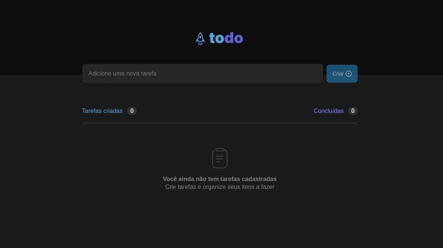
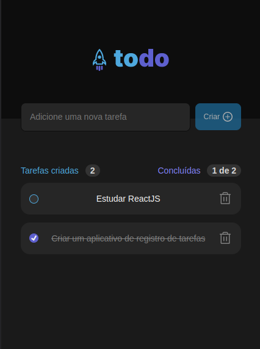

<h3 align="center">ToDo List</h3>

  <p align="center">
    TODO application to create tasks.
  </p>
</div>

<p align="center">
  
  
  
</p>

<p align="center">
 <a href="#about-the-project">About The Project</a> •
 <a href="#built-with">Built With</a> • 
 <a href="#prerequisites">Prerequisites</a> • 
 <a href="#installation">Installation</a> • 
 <a href="#features">Features</a> • 
 <a href="#license">License</a> •
 <a href="#author">Author</a>
</p>


## About The Project

<h3 align="center">Desktop</h3>
<h2 align="center">
    
</h2>

<h3 align="center">Mobile</h3>
<h2 align="center">
    
</h2>


### Built With

* [![React][React.js]][React-url]
* [![Typescript][Typescript]][Typescript-url]
* [![Yarn][Yarn]][Yarn-url]
* [![Vite][Vite]][Vite-url]


### Prerequisites

You will need yarn installed on your machine to run the project, to do so you can run the following commands on a UNIX terminal:
* yarn
  ```sh
  npm install --global yarn
  ```


### Installation

1. Clone the repo
   ```sh
   git clone https://github.com/raiffsaid/challenge01-ignite2022-reactjs.git
   ```
2. Install yarn packages
   ```sh
   yarn
   ```
3. In project root folder, run:
   ```sh
   yarn dev
   ```


## Features

- [x] Creation and deletion of tasks 
- [x] Mark tasks as concluded
- [x] Responsive layout for mobile devices
- [x] Persisted data with localStorage


## License

Distributed under the MIT License. See [LICENSE][license] for more information.


## 


## Author

 

 <sub><b>Raiff Said</b></sub>

 Get in contact:

[][linkedin-url] 
[][email]


<!-- MARKDOWN LINKS & IMAGES -->
<!-- https://www.markdownguide.org/basic-syntax/#reference-style-links -->
[linkedin-url]: https://linkedin.com/in/raiffsaid
[email]: mailto:raiff.said@gmail.com

[license]: https://github.com/raiffsaid/challenge01-ignite2022-reactjs/blob/main/LICENSE.md

[React.js]: https://img.shields.io/badge/ReactJS-20232A?style=for-the-badge&logo=react&logoColor=61DAFB
[React-url]: https://reactjs.org/

[Vite]: https://img.shields.io/badge/-vite-20232A?style=for-the-badge&logo=vite&logoColor=646CFF
[Vite-url]: https://vitejs.dev/

[Typescript]: https://img.shields.io/badge/Typescript-20232A?style=for-the-badge&logo=typescript&logoColor=3178C6
[Typescript-url]: https://www.typescriptlang.org/

[Yarn]: https://img.shields.io/badge/Yarn-20232A?style=for-the-badge&logo=yarn&logoColor=2C8EBB
[Yarn-url]: https://yarnpkg.com/

[License-Badge]: https://img.shields.io/github/license/raiffsaid/challenge01-ignite2022-reactjs?style=flat-square